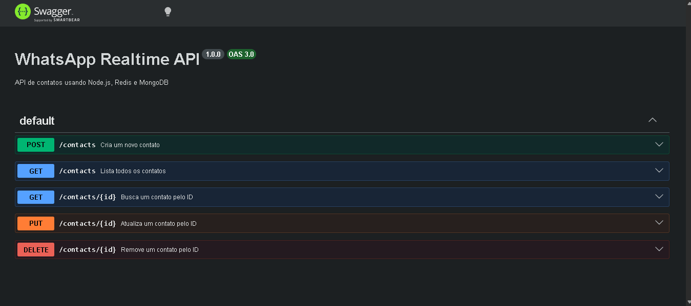

# WhatsApp Realtime API 🚀

**Sistema Backend com Node.js, Redis, MongoDB e Docker** desenvolvido para praticar arquitetura em camadas, APIs REST, comunicação assíncrona com Redis Pub/Sub e persistência de dados com MongoDB.

Este projeto foi construído como um desafio prático de backend, simulando um sistema de cadastro de contatos em tempo real utilizando eventos publicados no Redis e processados por um Listener independente.

## 🚀 Tecnologias Utilizadas

* Node.js
* Express
* Redis
* MongoDB
* Mongoose
* Docker
* Docker Compose
* Swagger

## 📱 Demonstração

### Documentação Swagger



## 📖 Sobre o Projeto

O projeto foi desenvolvido com foco em arquitetura backend moderna.

A API recebe requisições HTTP, valida os dados, persiste informações no MongoDB e publica eventos através do Redis.

Um serviço Listener separado escuta esses eventos e processa as mensagens recebidas, simulando cenários reais de comunicação assíncrona entre serviços.

## 🏗️ Arquitetura

### API Node

Responsável por:

* Receber requisições HTTP
* Validar dados
* Salvar contatos no MongoDB
* Publicar eventos no Redis

### Listener

Responsável por:

* Escutar eventos do Redis
* Processar mensagens recebidas
* Registrar logs dos contatos

## ✨ Funcionalidades

* ✅ Criar contatos
* ✅ Listar contatos
* ✅ Buscar contato por ID
* ✅ Atualizar contato
* ✅ Remover contato
* ✅ Validação de dados
* ✅ Prevenção de contatos duplicados
* ✅ Persistência com MongoDB
* ✅ Comunicação via Redis Pub/Sub
* ✅ Logs em arquivo
* ✅ Documentação Swagger
* ✅ Docker Compose

## 📚 Endpoints

### Contatos

* POST /contacts
* GET /contacts
* GET /contacts/:id
* PUT /contacts/:id
* DELETE /contacts/:id

## ⚙️ Como Executar

Clone o projeto:

```bash
git clone URL_DO_REPOSITORIO
```

Entre na pasta:

```bash
cd desafio-whatsapp-realtime
```

Execute:

```bash
docker compose up --build
```

API:

```text
http://localhost:3000
```

Swagger:

```text
http://localhost:3000/docs
```

## 🎯 Conceitos Praticados

* APIs REST
* Arquitetura em Camadas
* Controllers
* Services
* Routes
* Middlewares
* Redis Pub/Sub
* MongoDB
* Docker
* Swagger
* Tratamento Global de Erros

## 👨‍💻 Autor

Cristiano Rodrigues de Rezende

Projeto desenvolvido para estudos de Backend, APIs REST, Redis, MongoDB, Docker e arquitetura de sistemas.
